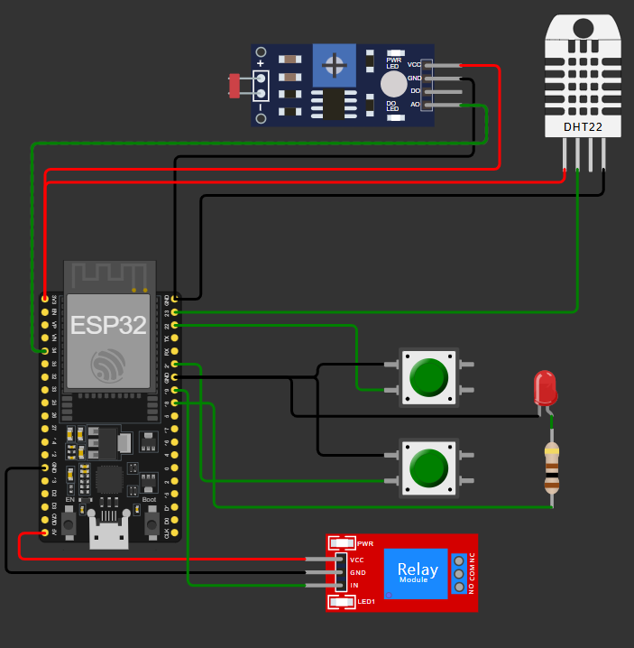
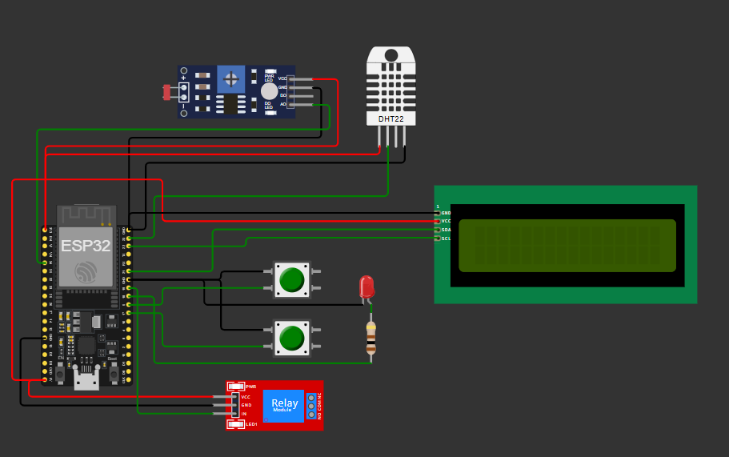
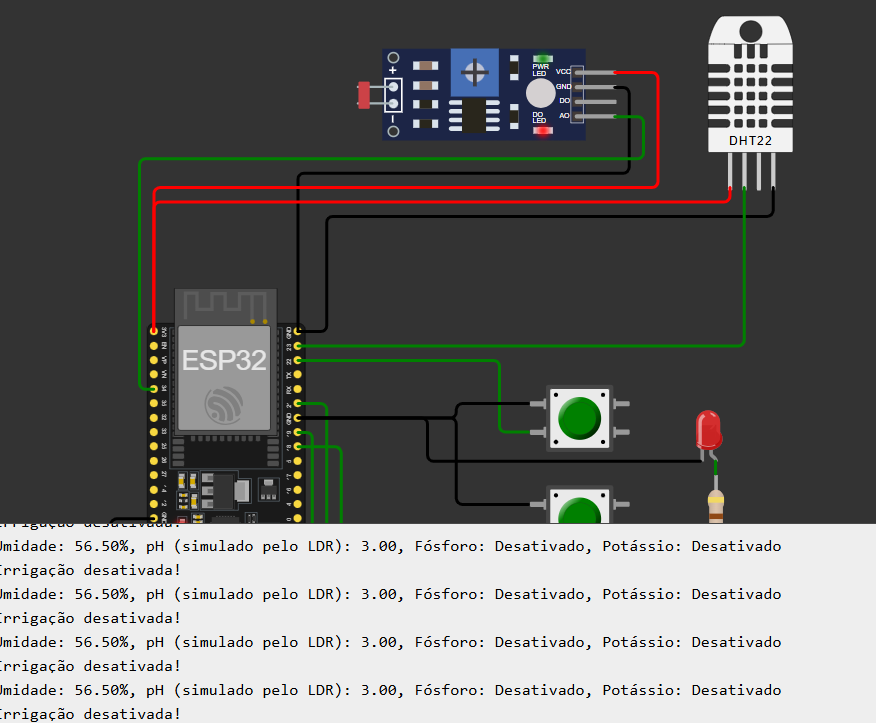
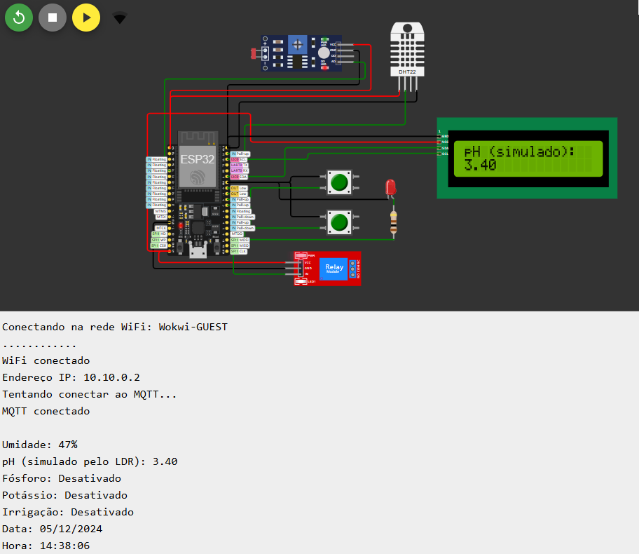

# FIAP - Faculdade de Informática e Administração Paulista

 

### FarmTech Solutions Versão atualizada
### Cap 1 - Automação e inteligência na FarmTech Solutions
---
## Nome do grupo

## 👨‍🎓 Integrantes: 
- <a href="https://www.linkedin.com/in/a1exlima/">RM559784@fiap.com.br - Alex da Silva Lima </a>
- <a href="https://www.linkedin.com/in/johnatanloriano/">RM559546@fiap.com.br - Johnatan Sousa Macedo Loriano</a>
- <a href="https://www.linkedin.com/in/matheus-maia-655bb1250/">RM560683@fiap.com.br - Matheus Augusto Rodrigues Maia</a>
- <a href="https://www.linkedin.com/in/brunoconter/">RM560518@fiap.com.br - Bruno Henrique Nielsen Conter</a>
- <a href="https://www.linkedin.com/in/fabiosantoscardoso/">RM560479@fiap.com.br - Fabio Santos Cardoso</a>

## 👩‍🏫 Professores:
### Tutor(a) 
- <a href="https://www.linkedin.com/in/lucas-gomes-moreira-15a8452a/">Lucas Gomes Moreira</a>
### Coordenador(a)
- <a href="https://www.linkedin.com/in/profandregodoi/">André Godoi</a>

## 📜 Descrição

O sistema realiza o monitoramento de parâmetros do solo através de sensores conectados a um ESP32, controlando automaticamente a irrigação com base nas leituras. Os dados são armazenados em um banco de dados SQL para análise histórica.

### Funcionalidades Principais:

- Monitoramento de umidade do solo (DHT22): Mede a umidade do solo para determinar quando a irrigação é necessária.
- Simulação de níveis de fósforo e potássio (botões): Utiliza botões para simular os níveis de nutrientes no solo.
- Medição de pH simulada (sensor LDR): Emprega um sensor LDR para simular a medição de pH do solo.
- Controle automatizado de irrigação (relé): Ativa o sistema de irrigação automaticamente com base nas leituras dos sensores.
- Armazenamento de dados em banco SQL: Guarda as leituras dos sensores em um banco de dados SQL para análises futuras.
- Operações CRUD para gestão dos dados: Permite criar, ler, atualizar e deletar dados no banco de dados.

### Atualizações Implementadas

- Incorporação do Scikit-learn: A biblioteca Scikit-learn foi integrada ao sistema de irrigação automatizado para aumentar sua inteligência. Utilizamos o Scikit-learn para desenvolver um modelo preditivo que analisa os dados históricos de umidade e nutrientes do solo. Com isso, o sistema pode prever a necessidade de irrigação em horários específicos do dia, otimizando o uso da água e garantindo que as plantas recebam a quantidade ideal de irrigação. Esta abordagem permite uma gestão mais eficiente dos recursos hídricos e melhora a saúde geral das plantas.

- Implementação do Streamlit: Foi implementado o Streamlit para aprimorar o dashboard do projeto. O Streamlit fornece uma interface interativa onde os dados do sistema de irrigação podem ser visualizados em tempo real. Gráficos dinâmicos mostram a variação da umidade do solo e os níveis de nutrientes, enquanto os insights gerados pelo modelo de Machine Learning ajudam na tomada de decisões informadas. Esta visualização facilita o monitoramento e a análise dos dados, permitindo ajustes rápidos e precisos no sistema de irrigação.

- Adição do Display LCD no Wokwi: Um display LCD foi conectado ao ESP32 no Wokwi, utilizando o barramento I2C. O display LCD exibe em tempo real as principais métricas do sistema, como a umidade do solo, níveis de nutrientes e o status da irrigação. Isso permite um monitoramento imediato das condições do solo diretamente no dispositivo físico, aumentando a transparência e a eficiência operacional do sistema. Este recurso é crucial para exibir informações críticas sem a necessidade de um computador ou dispositivo adicional.

- Monitoramento com Serial Plotter: Implementação do uso do Serial Plotter para monitorar variáveis do projeto. O Serial Plotter é usado para monitorar a umidade do solo em tempo real, proporcionando uma análise visual das mudanças nas leituras dos sensores. Isso auxilia na identificação rápida de padrões e anomalias no comportamento do sistema, permitindo intervenções mais rápidas e eficazes. O gráfico gerado pelo Serial Plotter facilita a interpretação dos dados de forma visual.

- Otimização de Memória no ESP32: Revisão e otimização do uso de variáveis no código C/C++ do ESP32. Foram realizadas otimizações no uso de tipos de dados inteiros, floats e chars para economizar memória e garantir que o sistema opere de maneira mais eficiente. Cada modificação foi comentada no código para justificar as escolhas de otimização. Isso resulta em um sistema que utiliza os recursos do ESP32 de forma mais eficaz, melhorando o desempenho geral e a estabilidade do projeto.

## Diagrama do Circuito Eletronico

#### Link para o diagrama e código no Wokwi https://wokwi.com/projects/414301079540361217

#### Link para o diagrama, versão atualizada: https://wokwi.com/projects/414443493615587329

## Monitor Serial

Monitor Serial mostrando o acionamento e comunicação dos dados de leitura e timestamp.

Monitor Serial após as atualizações para envio dos dados via MQTT.

## Funcionamento do Equipamento

## 📁 Estrutura de pastas

Dentre os arquivos e pastas presentes na raiz do projeto, definem-se:

- <b>docs</b>: Contém documentos relacionados ao projeto, incluindo o diagrama do circuito eletrônico, informações com dados das atualizações do projeto, relatório principal que descreve detalhadamente o projeto e suas funcionalidades e links de apresentação e simulação.

- <b>libraries</b>: Armazena as bibliotecas utilizadas no sketch do esp32 para o funcionamento correto de todas as funcionalidades.

- <b>public</b>: Reúne as imagens usadas no arquivo readme.md para apresentar o projeto no GitHub.

- <b>src</b>: Contém o sketch (código em C++ desenvolvido para o microcontrolador ESP32) e o arquivo JSON do diagrama para execução no simulador Wokwi.

- <b>tests</b>: Inclui uma pasta com o código em python que utiliza a biblioteca paho-mqtt para se conectar ao broker MQTT, assinar o tópico (farmTechSolutions) e processar mensagens JSON recebidas. Assim testando o envio e recebimento dos dados dos sensores.

- <b>gitIgnore</b>: Arquivo para especificar quais arquivos ou diretórios devem ser ignorados pelo controle de versão dos projetos git.

- <b>link_simulador.txt</b>: Arquivo txt que contém o link do simulador Wokwi que redireciona para o projeto esp32 onde contem o código C++ e o circuito eletrônico proposto.

- <b>README.md</b>: Documento de apresentação do projeto no GitHub, explicando suas funcionalidades em formato Markdown.

## Arquivos Importantes

- **Circuito Eletrônico**: Diagrama eletrônico do sistema.
  - [circuito_eletronico.png](public/circuito_eletronico_v2.0.png)

- **Projeto Wokwi**: Link para o projeto no Wokwi.
  - [projeto_wokwi.md](docs/link_simulador.txt)
  
- **Código Arduino**: Código desenvolvido para o ESP32.
  - [sketch.ino](/src//sketch/sketch.ino)
  
- **Diagrama do Wokwi**: Diagrama das peças no Wokwi.
  - [diagram.json](src/diagram.json)
  
## 📺 **Link para o vídeo no YouTube**

- [Assistir ao vídeo do projeto no YouTube](https://)

## 🔧 Como executar o código

## 🗃 Histórico de lançamentos

* 1.0.0 - 12/11/2024
* 2.0.0 - 06/12/2024

## 📋 Licença

<a property="dct:title" rel="cc:attributionURL" href="https://github.com/agodoi/template">MODELO GIT FIAP</a> por <a rel="cc:attributionURL dct:creator" property="cc:attributionName" href="https://fiap.com.br">Fiap</a> está licenciado sobre <a href="http://creativecommons.org/licenses/by/4.0/?ref=chooser-v1" target="_blank" rel="license noopener noreferrer" style="display:inline-block;">Attribution 4.0 International</a>.

